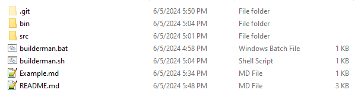
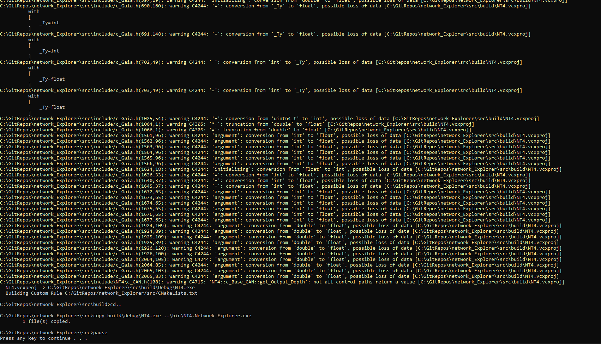
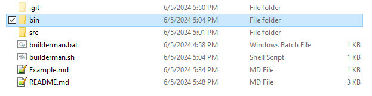
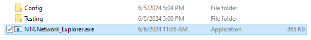
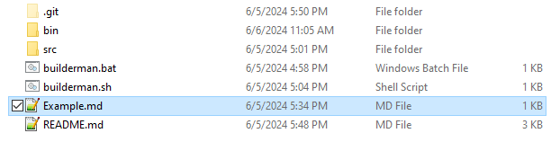
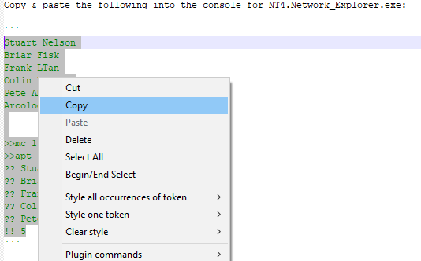
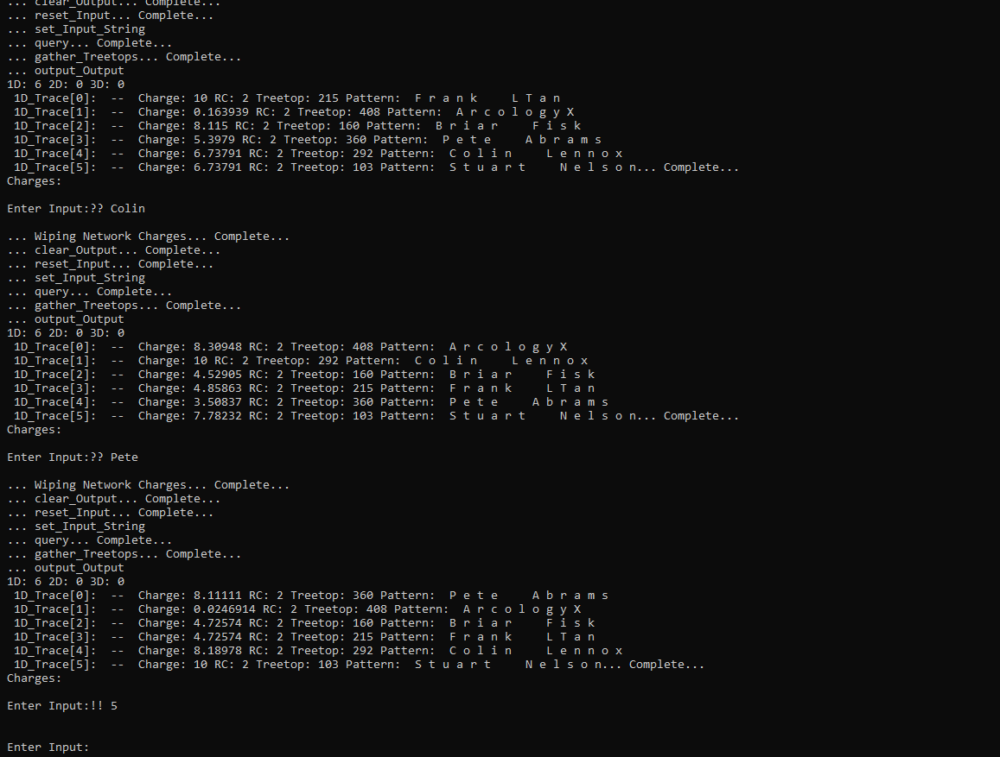
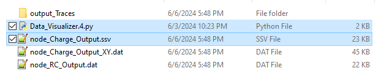
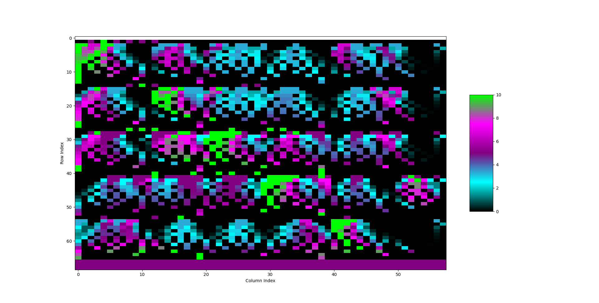

# network_Explorer
This is used to explore activation mappings for NT4

It loops through a basic menu, you can enter special tokens to signal a command, or just type things in to have the network learn them.

If you're on Windows you should be able to run "builderman.bat" in the project root directory.



Run "builderman.bat" for windows and "builderman.sh" for Linux/MacOS



You should see it compile and say it copied 1 file.



The exe is in the bin folder.



The program is called "NT4.Network_Explorer.exe"



There is an example you can play with in 'Example.md'. This should create the attached image when viewing the charge_Output.ssv file using the Data_Visualizer.4.py.



Run the NT4.Network_Explorer.exe and copy/paste the code-block from 'Example.md' into the NT4.Network_Explorer.exe.



The output should look like this image.



The output is located in "./bin/Testing/Node_Network_Output/". The Data_Visualizer.4.py is used to generate the heatmap. note_Charge_Output.ssv is the data file it reads.



Data_Visualizer.4.py should generate a heatmap matching this image.


To use the visualizer you need python and pip.
https://www.python.org/

After you have that run this on your command line:
```
pip install numpy matplotlib
```

Then after running it you can find the "Data_Visualizer.4.py" in the folder "./bin/Testing/Node_Network_Output/"


User Manual:

Command: "??":

Using '??' signals a query. Use the format '?? [QUERY]' where [QUERY] is the pattern to search for.

Example:
```
Enter Input:?? abc
```

Searches the network for "abc" and outputs the results to various files in the './Testing/Node_Network_Output/' sub-dir.
Output traces are output to the file './Testing/Node_Network_Output/output_Traces/output_Traces.ssv'. 
The activation mapping is output to '/Testing/Node_Network_Output/node_Charge_Output.ssv' and is the file the 'Data_Visualizer.4.py' works for. 
The reinforcement counter mapping is output to '/Testing/Node_Network_Output/node_RC_Output.dat'.

Changing the filename from '.dat' to '.ssv' will cause 'Data_Visualizer.py' to pick them up and attempt to display them. It will only work on the output_Traces.ssv if the pattern string represents numbers.


Command: ">>apt":

	>>apt [Action_Potential_Threshold]

Sets the action potential threshold, one of the hyperparameters. To let all charges through use 0.0, if the network is dead then you set this too high.

Example:
```
Enter Input:>>apt 0.123
```


Command: ">>mc":

Sets the modifier charge, one of the hyperparameters. Determines how much of a charge passes, 1.0 is the full charge, 0.0 kills the network, and 1.0+ can boost signals to the end of the network that otherwise wouldn't. 

Example:
```
Enter Input:>>mc 0.98
```


Command: "<<":

This outputs the CAN scaffold to the console with the symbol output.

Example:
```
Enter Input:<<
```


Command: "!!":

Example:
```
Enter Input:!! 5
```

This example appents 3 rows with a value of 5 in each cell to the activation mapping, this creates a clear delineation between sections.


Command: "##":

Example:
```
Enter Input:## 67890
```

This example will output the information for the node #67890, the raw stats and the pattern it represents.


Command: "-exit":

Example:
```
Enter Input:-exit
```
Exits.
